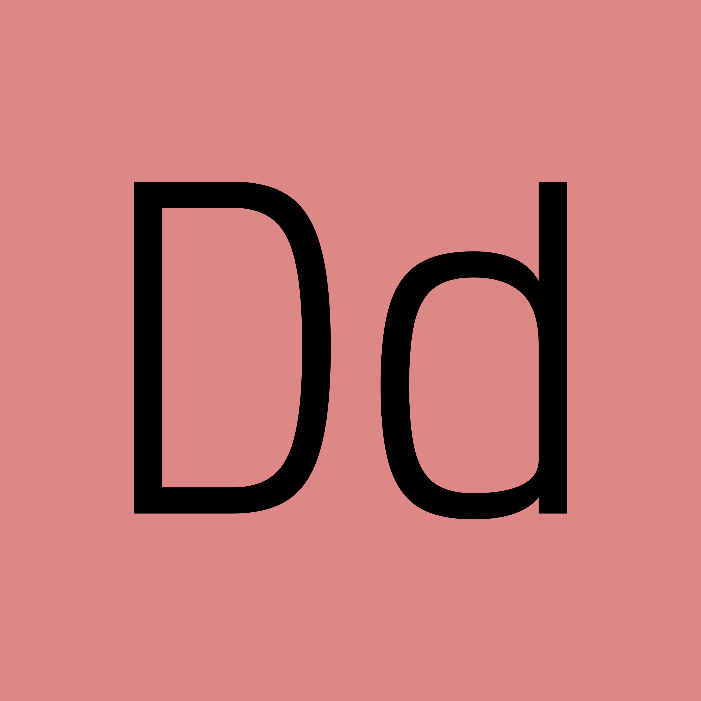

      
<b><i>Just another PDF reader, but it's not</i></b>

**Dodo** is a fast, keyboard-friendly PDF reader built for
smooth reading, quick navigation, and deep customization. It uses MuPDF for
rendering and Qt for the UI. If you read papers, manuals, or long PDFs and want speed + control, this is for you.

> [!NOTE]
> Latest dodo version is v0.5.4

## Check out dodo's webpage: [dheerajshenoy.github.io/dodo](https://dheerajshenoy.github.io/dodo)

## Screenshots

### Home screen

### Scrolling View

### Layouts

### File opened + outline panel

### Search Marker in Scrollbar

### Jump Marker feature in action

### Synctex forward search from dodo to tex editor (Zed editor in this case)

## Features

- Fast rendering with MuPDF backend
- Tabs, recent files, and session restore
- Search with highlight markers on the scrollbar
- Outline (table of contents) panel
- Annotation tools: highlight, rectangle, popup
- Region selection: copy text, copy as image, save, or open externally
- Link detection and keyboard link hints
- SyncTeX support for LaTeX workflows
- Fully configurable keybindings
- Smooth scrolling and page caching
- Optional LLM widget (compile-time flag)
