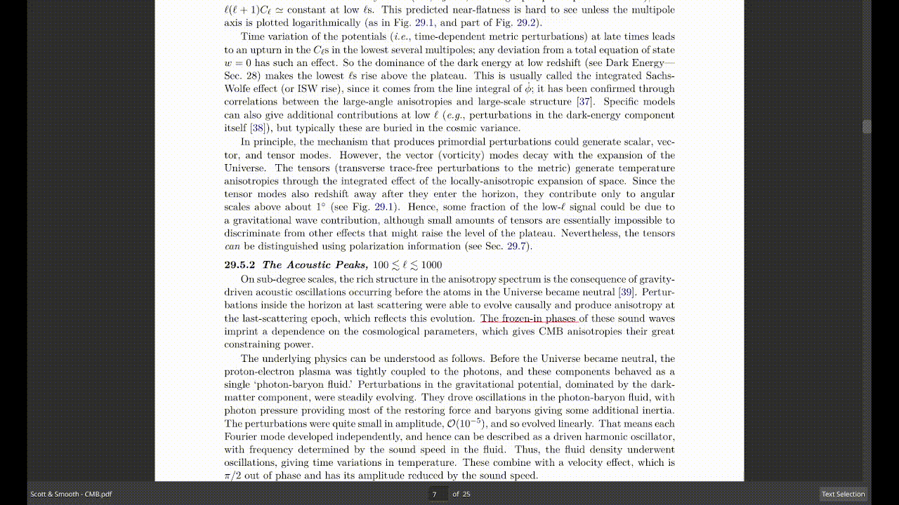

<p align="center">
    <br><br>
<b><i>A fast and unintrusive PDF reader.</i></b>
</p>

[](https://opensource.org/license/agpl-v3)

**Dodo** (pronounced "doh-doh", and yes, named after the now extinct bird) is an unintrusive, highly customizable and high-performance PDF reader designed to provide a smooth and
efficient document viewing experience. Built using MuPDF and Qt, it supports tabs, does fast rendering,
annotation handling (highlights and rects), and advanced features like SyncTeX integration for LaTeX users.
Whether you're reading academic papers, technical manuals, or everyday documents, this reader offers a
streamlined interface and robust functionality with minimal resource usage.

> [!NOTE]
> Latest dodo version is v0.4.2

## Table of Contents

- [Screenshots](#screenshots)
- [Features](#features)
- [Dependencies](#dependencies)
- [Installation](#installation)
    - [Arch Linux](#arch-linux)
    - [Debian/Ubuntu](#debianubuntu)
    - [Others](#others)
- [Usage](#usage)
- [Configuration](#configuration)
- [Theming dodo](#theming-dodo)
- [TODO](#todo)
- [Contributing](#contributing)
- [FAQ](#faq)

## Screenshots

### Home screen


### File opened + outline panel


### Jump Marker feature in action


### Synctex forward search from dodo to tex editor (Zed editor in this case)

</p>

## Features

- Fast rendering with MuPDF backend
- Auto reloading on file changes
- **SyncTeX** support (reverse search and goto reference from LaTeX editors)
- Session management (restore tabs and opened files on next launch)
- Table of Contents panel
- Recent files list
- Keyboard shortcuts for all major actions (customizable)
- Mouse gestures for navigation (customizable)
- Dark mode support
- Smooth scrolling
- Caching and pre-fetching pages for faster page rendering
- Configured using TOML language
- Tabs support
- Faster search
- File history management
- Link awareness
- Annotation support (popup, highlight, rectangle)
- Undo/Redo
- Multi-click text selection (double, triple, quadruple click for word, line, paragraph)
- Jump Marker (to help locate where link takes you to)
- Region select mode (copy text, copy as image, save as image, open externally)
- Wayland support

## Dependencies

- Qt6
- MuPDF
- synctex \[for reverse searching and goto reference from LaTeX\]
- CMake (for building)
- Ninja (for building)

### Dependency for building MuPDF

- glu

## Installation

> [!NOTE]
> There are two branches in dodo.
>
> 1. `main (default)` - This branch has all the stable features. (recommended)
> 2. `AI` - This branch has AI based features like summarization, text extraction etc. (not as updated as main branch)
>

> [!NOTE]
> The `install.sh` script installs latest version of MuPDF library required for dodo

> [!WARNING]
> Sometimes the latest MuPDF version may have compatibility issues with dodo. For now, you have to go into the `install.sh` script
> and change the version to a latest one that is known to work with dodo.

> [!NOTE]
> By default dodo is installed to `/usr/local/` directory. You can change this by passing a different prefix to the `install.sh` script like so:
>```bash
> ./install.sh /your/custom/prefix
> Example: ./install.sh /usr
>```

> [!NOTE]
> The .deb and .zst packages are not officially supported at the moment, but will be in the future. For now please build from source.

### Arch Linux

```bash
sudo pacman -Syu qt6-base qt6-svg libsynctex cmake ninja glu
git clone https://github.com/dheerajshenoy/dodo
cd dodo
./install.sh
```

### Debian/Ubuntu

```bash
sudo apt update && sudo apt install qt6-base-dev qt6-svg-dev libsynctex-dev cmake ninja-build freeglut3-dev
git clone https://github.com/dheerajshenoy/dodo
cd dodo
./install.sh
```

### Others

1. Install the required dependencies
2. Clone the repository and build similar to the Arch Linux build approach.

> [!NOTE]
> If the text in the PDF appears blurry or not rendered properly, ensure that you have set the `dpr` equal to your screen's scale factor in the configuration file.

# Usage

Check out [USAGE](./USAGE.md) to learn how to use dodo.

## Configuration

Check out [CONFIGURATION](./CONFIGURATION.md) to learn how to configure dodo.

## Theming dodo

**Kvantum (Recommended)**

Kvantum is a powerful SVG-based theme engine for Qt.
It supports dark themes, custom widgets, and integrates well with Qt6.

Check out kvantum's install page [here](https://github.com/tsujan/Kvantum/blob/master/Kvantum/INSTALL.md)

Once installed, you can select a theme you like in the `kvantummanager` app and
add `QT_STYLE_OVERRIDE=kvantum` env variable. On the next launch, you should have
the specified theme loaded in dodo.

## TODO

Check out [TODO.md](./TODO.md)

## Contributing

Pull requests are welcome. For major changes, please open an issue first to discuss what you'd like to change.

## FAQ

#### Can I use Dodo on Wayland?
Yes, Dodo supports Wayland natively.

#### How do I report bugs?
Open issues on the GitHub repository here.
