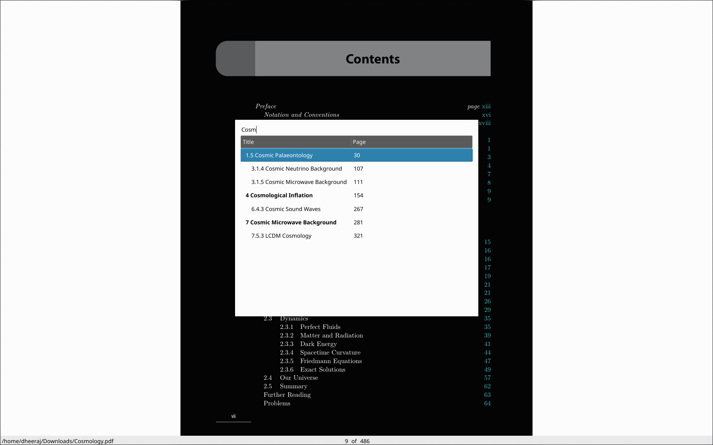
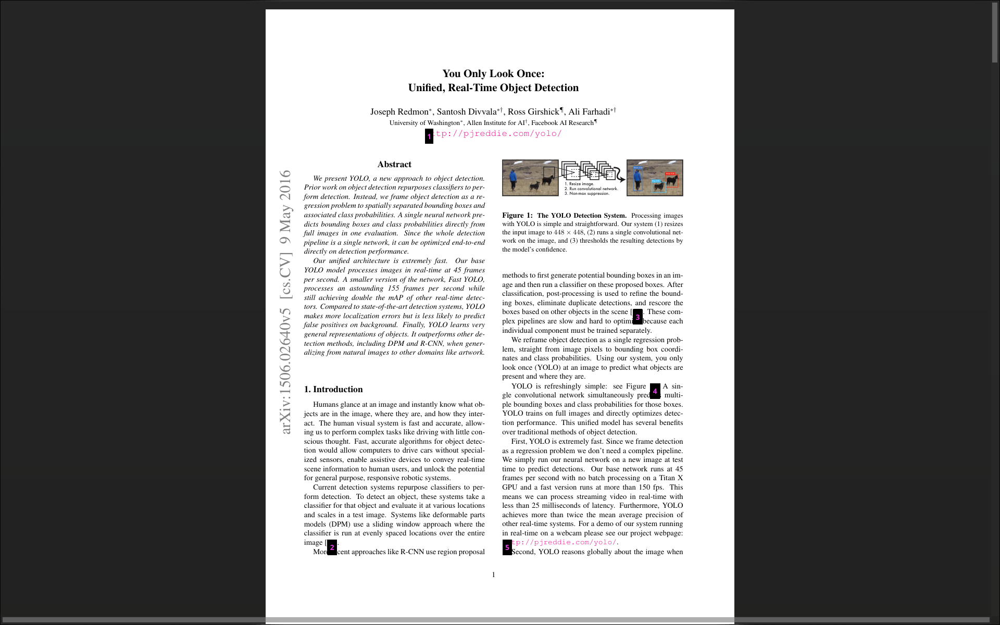
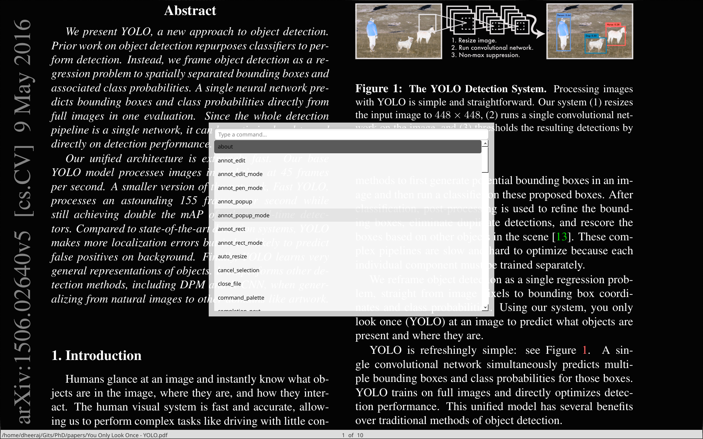

      
<b><i>A fast, configurable PDF reader built with MuPDF and Qt</i></b>

    <a href="https://dheerajshenoy.github.io/dodo.html" target="_blank">Homepage</a> |
    <a href="https://dheerajshenoy.github.io/dodo.html#install" target="_blank">Installation</a> |
    <a href="https://dheerajshenoy.github.io/dodo-docs.html" target="_blank">Documentation</a> |
    <a href="https://dheerajshenoy.github.io/dodo-configuration.html" target="_blank">Configuration</a>

> [!NOTE]
> Latest dodo version is v0.6.0

## Screenshots

### Home screen

### Scrolling View

### Layouts

### File opened + outline overlay

### Search Marker in Scrollbar

### Jump Marker feature in action

### Link Hints

### Command Palette

### Synctex forward search from dodo to tex editor (Zed editor in this case)

## Check out dodo's [homepage](https://dheerajshenoy.github.io/dodo) for more details

## If you want to support me

