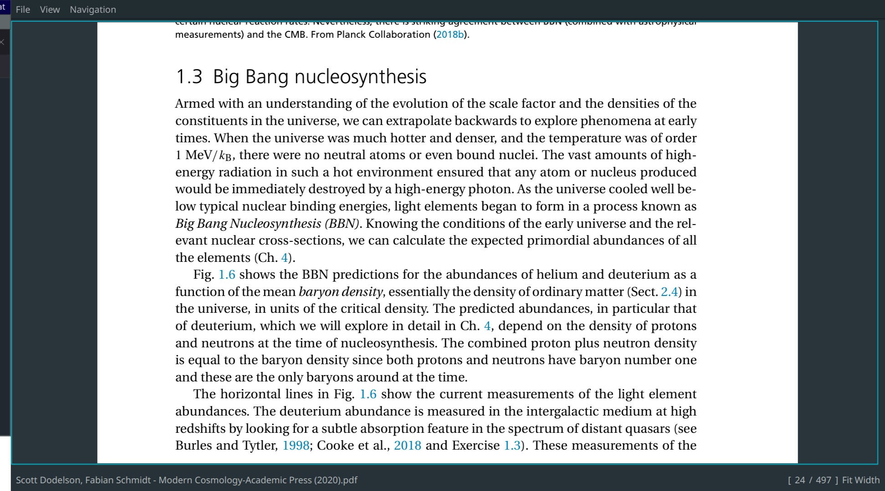

A fast and unintrusive PDF reader.

## Why ?

- Because okular is bloated and it is the only good pdf reader that seems to exist.
- Also, because I always wanted to create a PDF reader because when I am not developing a
PDF reader, I am reading lots of PDFs for my work.



## Features

- Fast MuPDF backend
- Caching and pre-fetching pages for faster page rendering
- Vim-like keybindings
- configured using TOML language
- Faster search
- Visited file location saving
- Link awareness
- Save annotations

## Dependencies

- Qt6
- mupdf
- libsynctex
- cmake (for building)
- make (for building)

## Installation

1. Install the required dependencies
2. Clone this repo
3. Once inside the repo directory, run the following commands

```bash
mkdir build &&
cd build &&
cmake .. -DCMAKE_BUILD_TYPE=Release -DCMAKE_INSTALL_PREFIX=/usr &&
make -j$(nproc) &&
sudo make install
```

## Configuration

Dodo will search for `config.toml` file in the `~/.config/dodo` directory, and load it if it exists.
Check out the `config.toml` file for reference

## TODO

- [X] HiDPI support
- [ ] Annotations
    - [X] Basic rectangle highlight
    - [ ] Word aware highlight
- [X] Table of Contents
- [X] Keyboard link navigation
- [ ] Complex searches
- [X] Visited file location
- [X] Keyboard navigation
- [X] Search (with highlight)
- [ ] Synctex support
- [ ] Clicking figure names
- [ ] file:/// link click support

## Tools Used

- Neovim - my beloved text editor, without which I wouldn't be so fast in my commits :)
- ChatGPT - ofc, it's 2025, I'm not gonna lie...
- Qt forums and other websites
- MuPDF discord channel
